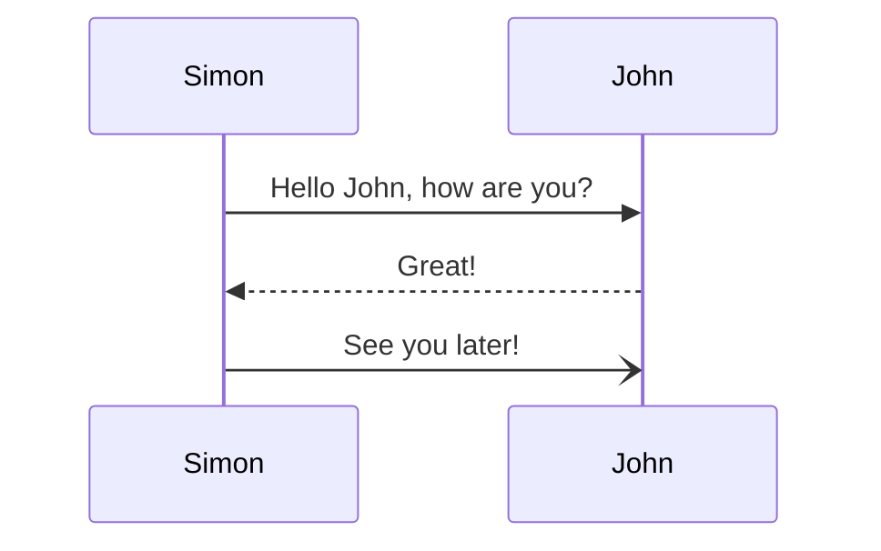

# GitHub version Markdown

- Item 1
- Item 2
- Item 3
- Item 4
- Item 5

1. Item 1
2. Item 2
3. Item 3
4. Item 4
5. Item 5

|Column A|Column B|
|---|---|
|Value A|Value B|

> [!NOTE]
> This is a note, highlighting information that users should take into account.

> [!TIP]
> This is a helpful tip, offering optional information for better results.

> [!IMPORTANT]
> This is an important message, containing crucial information necessary for users to succeed.

> [!WARNING]
> This is a warning, demanding immediate user attention due to potential risks.

> [!CAUTION]
> This is a caution, advising about potential negative consequences of an action.

```razor
@page "/counter"

<PageTitle>Counter</PageTitle>

<h1>Counter</h1>

<p role="status">Current count: @currentCount</p>

<button class="btn btn-primary" @onclick="IncrementCount">Click me</button>

@code {
    private int currentCount = 0;

    private void IncrementCount()
    {
        currentCount++;
    }
}
```


